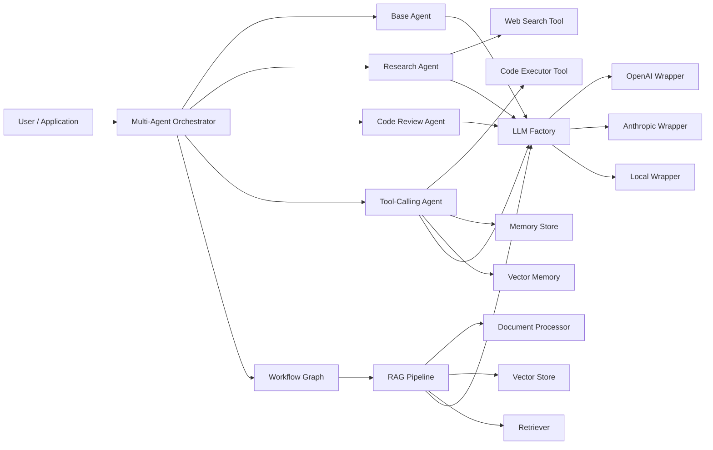
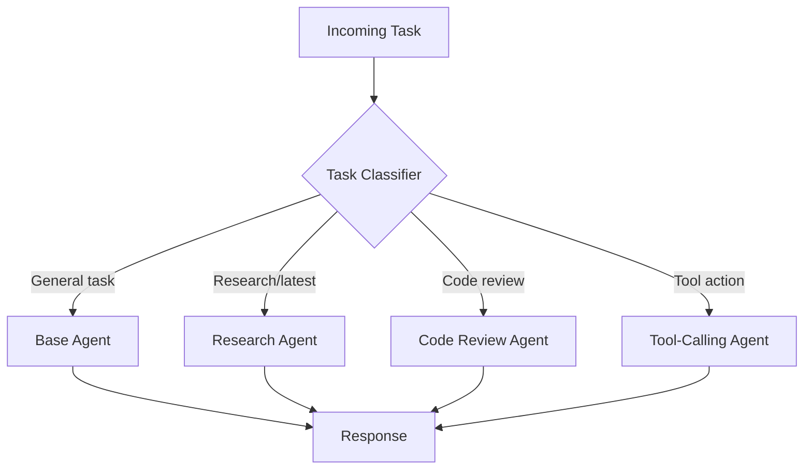
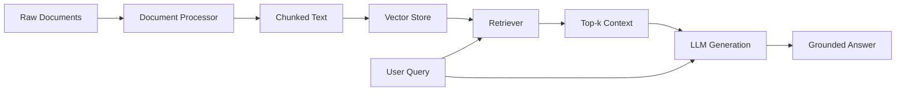
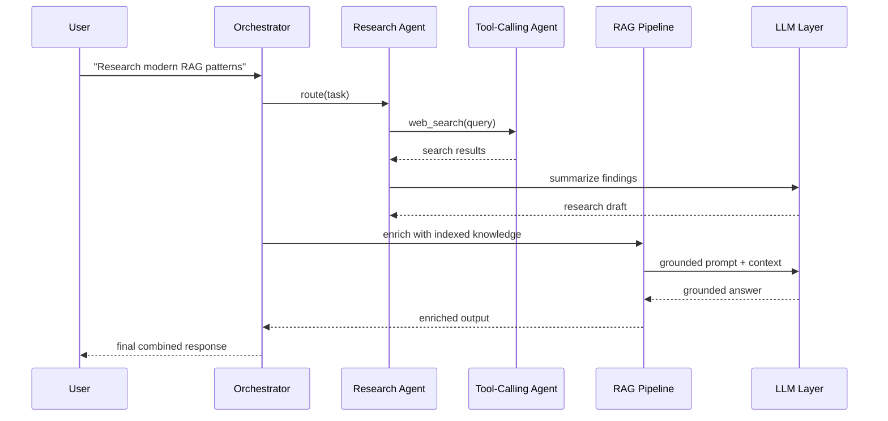

# AI Agents - Brennan Technologies

A modular Python framework for building agentic AI systems with:

- Specialized agents (base, research, code review, orchestrator, tool-calling)
- Retrieval-Augmented Generation (RAG) pipeline
- Provider-agnostic LLM integration layer (OpenAI, Anthropic, local)
- Tooling layer (web search, code execution, memory/vector memory)
- LangGraph-style workflow orchestration
- Runnable examples and architecture documentation

## Project Goals

This repository is designed as a practical starting point for multi-agent and RAG-based applications. It emphasizes:

- Clear separation of concerns
- Extensibility for production systems
- Simple local-first defaults for quick iteration

## High-Level Architecture



## Agent Flow Diagram



## RAG Pipeline Diagram



## Multi-Agent Collaboration Diagram



## Repository Structure

```text
.
├── ai_agents/
│   ├── agents/
│   │   ├── base_agent.py
│   │   ├── research_agent.py
│   │   ├── code_review_agent.py
│   │   ├── tool_calling_agent.py
│   │   └── orchestrator.py
│   ├── llm/
│   │   ├── base.py
│   │   ├── factory.py
│   │   ├── openai_wrapper.py
│   │   ├── anthropic_wrapper.py
│   │   └── local_wrapper.py
│   ├── rag/
│   │   ├── document_processor.py
│   │   ├── vector_store.py
│   │   ├── retriever.py
│   │   └── pipeline.py
│   ├── tools/
│   │   ├── web_search.py
│   │   ├── code_executor.py
│   │   ├── memory_store.py
│   │   └── vector_memory.py
│   └── workflows/
│       ├── langgraph_style.py
│       └── graph.py
├── examples/
│   ├── run_base_agent.py
│   ├── run_research_agent.py
│   ├── run_code_review.py
│   ├── run_rag_pipeline.py
│   └── run_multi_agent_workflow.py
├── .env.example
├── requirements.txt
└── pyproject.toml
```

## Setup

### 1) Create and activate virtual environment

#### Windows (PowerShell)

```powershell
python -m venv .venv
.\.venv\Scripts\Activate.ps1
```

#### macOS/Linux

```bash
python -m venv .venv
source .venv/bin/activate
```

### 2) Install dependencies

```bash
pip install -r requirements.txt
```

### 3) Configure environment

Copy `.env.example` to `.env` and set keys as needed:

```env
OPENAI_API_KEY=...
ANTHROPIC_API_KEY=...
DEFAULT_LLM_PROVIDER=local
DEFAULT_MODEL_NAME=local-echo-v1
```

If you keep `DEFAULT_LLM_PROVIDER=local`, examples run without paid API keys.

## Component Walkthrough

### Agents

- `BaseAgent`: generic prompt/response behavior.
- `ResearchAgent`: gathers search results and synthesizes findings.
- `CodeReviewAgent`: performs structured code-review style analysis.
- `ToolCallingAgent`: chooses and executes tools (search/code/memory) based on task intent.
- `MultiAgentOrchestrator`: routes tasks to the best specialist.

### RAG Pipeline

- `DocumentProcessor`: cleans and chunks text.
- `InMemoryVectorStore`: stores token vectors for chunks.
- `Retriever`: similarity search over indexed chunks.
- `RAGPipeline`: end-to-end indexing + retrieval + grounded generation.

### LLM Integration

- `create_llm_client(...)` in `factory.py` implements factory pattern selection.
- OpenAI and Anthropic wrappers call real provider APIs.
- Local wrapper provides deterministic fallback for offline demos/tests.

### Tools

- `WebSearchTool`: fetches search results from DuckDuckGo.
- `CodeExecutor`: runs Python snippets in a temporary file.
- `MemoryStore`: key-value JSON memory.
- `VectorMemory`: semantic memory on top of vector retrieval.

### Workflows (LangGraph-style)

- `WorkflowGraph`: node/edge execution model.
- `build_default_workflow(...)`: route task -> optional RAG enrichment -> compose output.

## Runnable Examples (Step-by-Step)

Run from repository root after setup.

### Example 1: Base Agent

```bash
python examples/run_base_agent.py
```

What happens:

1. Creates local LLM client.
2. Instantiates `BaseAgent`.
3. Executes a simple planning task.

### Example 2: Research Agent

```bash
python examples/run_research_agent.py
```

What happens:

1. Runs web search for a topic.
2. Compiles results.
3. Uses LLM to summarize insights.

### Example 3: Code Review Agent

```bash
python examples/run_code_review.py
```

What happens:

1. Loads sample code.
2. Sends structured review prompt.
3. Returns severity-focused feedback.

### Example 4: RAG Pipeline

```bash
python examples/run_rag_pipeline.py
```

What happens:

1. Indexes in-memory documents.
2. Retrieves top-k relevant chunks.
3. Generates grounded answer.

### Example 5: Multi-Agent Workflow

```bash
python examples/run_multi_agent_workflow.py
```

What happens:

1. Creates specialist agents and orchestrator.
2. Builds workflow graph.
3. Routes request through orchestration + RAG enrichment.
4. Produces composed final output.

## Extending This Repository

- Swap `InMemoryVectorStore` with FAISS, Chroma, Qdrant, or pgvector.
- Add tool schemas and explicit function-calling protocols.
- Integrate observability (traces, token usage, latency).
- Add evaluation harnesses (groundedness, relevance, toxicity, drift).
- Replace simple workflow graph with full LangGraph runtime if desired.

## Notes

- `CodeExecutor` runs local Python snippets; for production, isolate execution with stronger sandboxing.
- Web search quality and availability depend on network and upstream services.
- Local model wrapper is intentionally simple and deterministic.